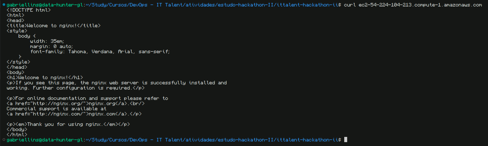

<h1>2º Hackathon DevOps T2 - IT Talent Turma 2023.2</h1>

Este repositório contém os artefatos desenvolvidos durante o 2º Hackathon DevOps, focado no provisionamento de uma instância EC2 na AWS usando Terraform e integração com GitHub Actions.

**Dupla:**

- Gabriel Lopes

- Gabriel Lins

---

<h2>Índice</h2>

- [Descrição do Projeto](#descrição-do-projeto)
- [Detalhamento dos Componentes](#detalhamento-dos-componentes)
  - [Automação e Integração Contínua com GitHub Actions e Terraform Cloud](#automação-e-integração-contínua-com-github-actions-e-terraform-cloud)
    - [GitHub Actions: Terraform Apply e Plan](#github-actions-terraform-apply-e-plan)
    - [Arquivo `main.tf`: Configuração Terraform](#arquivo-maintf-configuração-terraform)
  - [Provisionamento da Instância EC2](#provisionamento-da-instância-ec2)
    - [Console da AWS com a EC2](#console-da-aws-com-a-ec2)
    - [Acesso por SSH](#acesso-por-ssh)
    - [Curl para o DNS público da instância EC2](#curl-para-o-dns-público-da-instância-ec2)
    - [DNS público no navegador](#dns-público-no-navegador)
  - [Configuração de Segurança e Acesso](#configuração-de-segurança-e-acesso)
  - [Actions do GitHub sucesso (de primeira)](#actions-do-github-sucesso-de-primeira)
  - [TerraformCloud Run sucesso](#terraformcloud-run-sucesso)

---

## Descrição do Projeto

O desafio proposto envolve o provisionamento de uma instância EC2 na AWS utilizando Terraform. O código Terraform abrange a criação da instância EC2, configuração do security group, credenciais SSH, e a instalação de um servidor web, assegurando um servidor pronto para uso e acessível publicamente pelo endereço DNS.

## Detalhamento dos Componentes

### Automação e Integração Contínua com GitHub Actions e Terraform Cloud

#### GitHub Actions: Terraform Apply e Plan

- **Terraform Apply**: Workflow `terraform-apply.yml`, acionado por push no branch principal, faz upload da configuração para o Terraform Cloud, cria uma execução e aplica as mudanças. Organização no Terraform Cloud: "ITTalent-Hackathon-ii-GabrielGabriel"; workspace: "terraform-github-actions-devops-hackathon".

- **Terraform Plan**: Workflow `terraform-plan.yml`, acionado por pull requests, faz upload da configuração para o Terraform Cloud e cria uma execução de planejamento, com resultados exibidos na PR.

#### Arquivo `main.tf`: Configuração Terraform

- Define a configuração do provider AWS e a infraestrutura, incluindo um Security Group e uma instância EC2, com a região `us-east-1` e o tipo `t2.nano`.
- Security Group configurado para permitir todo tráfego ingresso e egresso.
- Saída `ec2_public_ips` exibe o IP público da instância EC2.

### Provisionamento da Instância EC2

Utilizamos Terraform para provisionar uma instância EC2 na AWS, configurando automaticamente todas as características essenciais para tornar o servidor acessível publicamente.

#### Console da AWS com a EC2

#### Acesso por SSH

#### Curl para o DNS público da instância EC2

#### DNS público no navegador

### Configuração de Segurança e Acesso

Implementamos um Security Group e geramos credenciais SSH para um acesso seguro à instância EC2, mantendo a integridade do sistema.

### Actions do GitHub sucesso (de primeira)

### TerraformCloud Run sucesso

